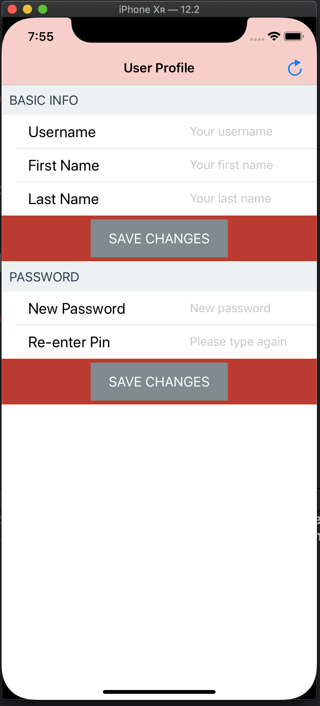
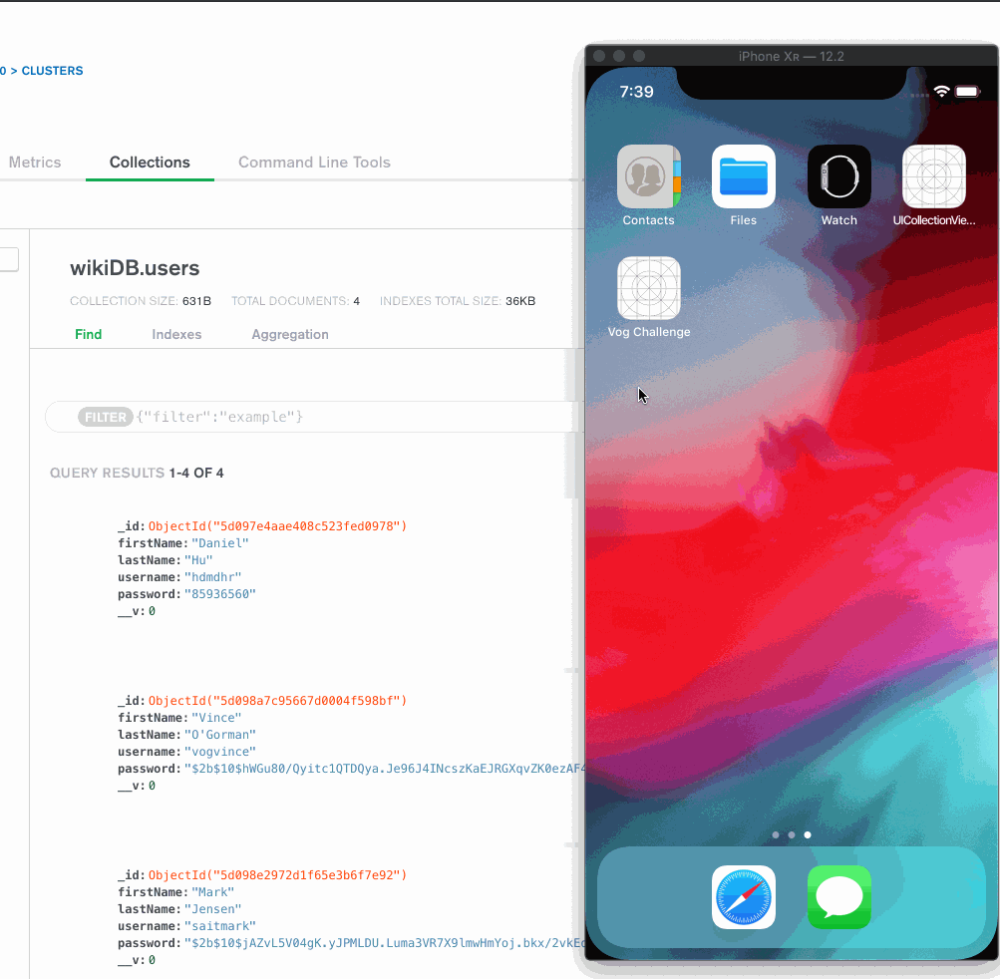

<h1></h1>

<h1></h1>
<h6 align="center"> This app is made to pass Vog coding challenge. </h6>

<h1></h1>

# User Tracker
An iOS single view mobile app. It connects to a self-built API to perform CRUD operations on a database.  
App is created with Swift 5.0 and Xcode 10.
API is created with node.js, deployed on Heroku.
Database is MongoDB.

> API is deployed on heroku and can be accessed globally. e.g. https://whispering-coast-70375.herokuapp.com/articles

## Work Together With - WiKi API (not wikipedia)
[**WiKi API**](https://github.com/hdmdhr/WiKi-RESTful-API)

## Usage
  
> JWT authentication feature is on the way.  
> With this app, you can access user info through API using username. Once user info displayed, you can update that user's profile, change password. App also included a minimum input validation.

## Author
* **DongMing Hu** - [hdmdhr](https://github.com/hdmdhr)

## More Apps Developed by Author
* [**ToDo+Note (iOS App)**](https://github.com/hdmdhr/ToDo-Note)
* [**Furious Birds (iOS Game)**](https://github.com/hdmdhr/Furious-Birds)
* [**Travel Experts Web (ASP.NET)**](https://github.com/hdmdhr/Travel-Agency-Web-App)
